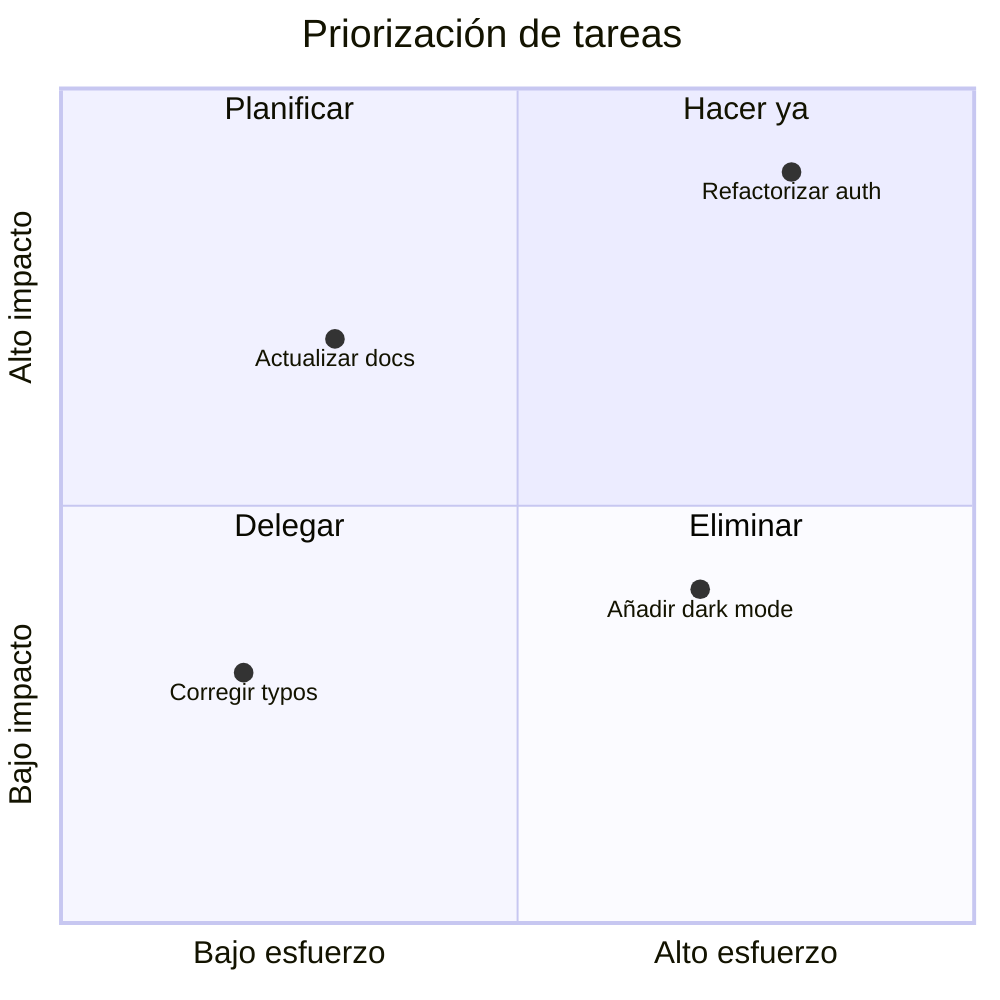
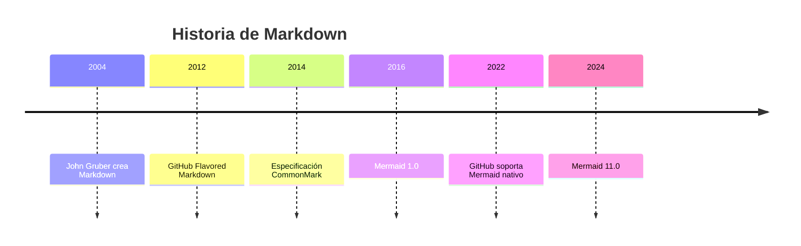
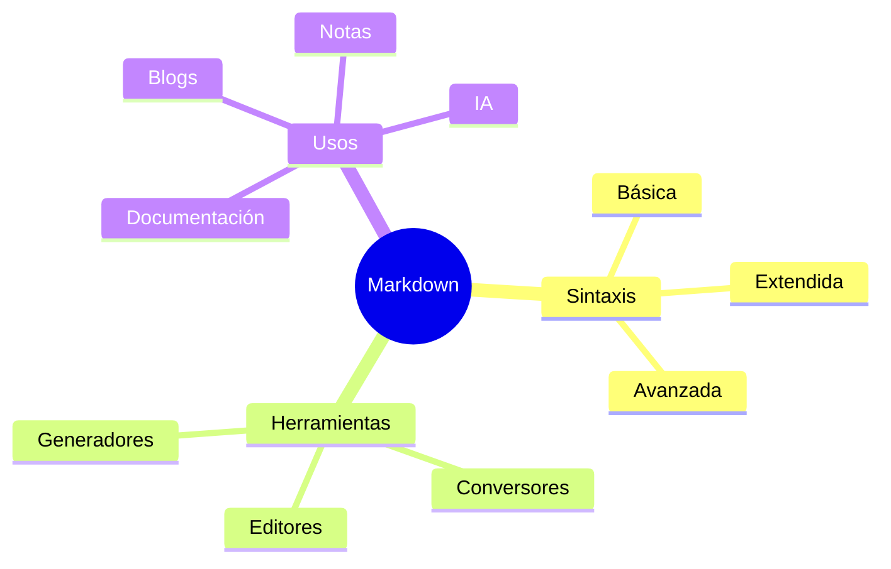
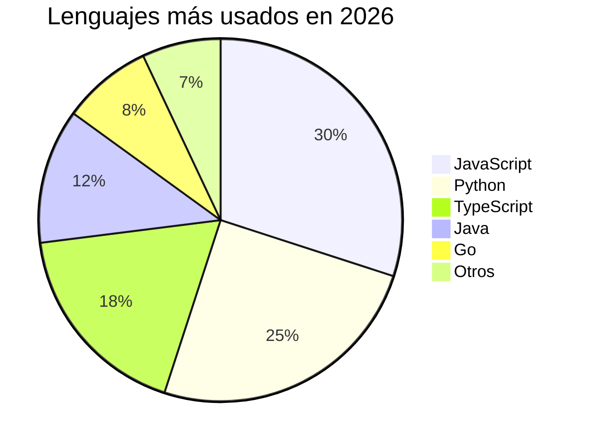
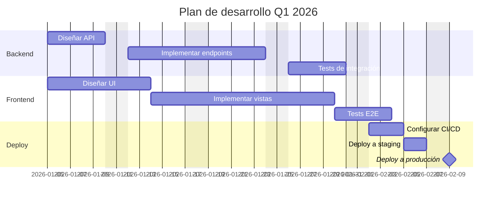
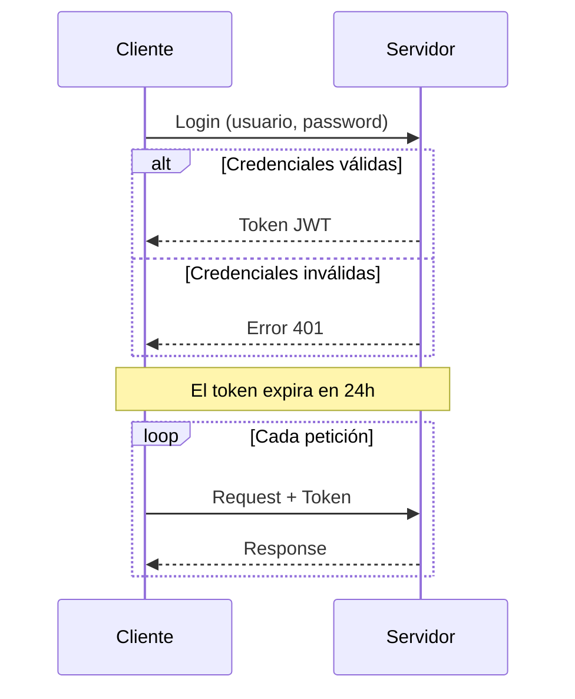
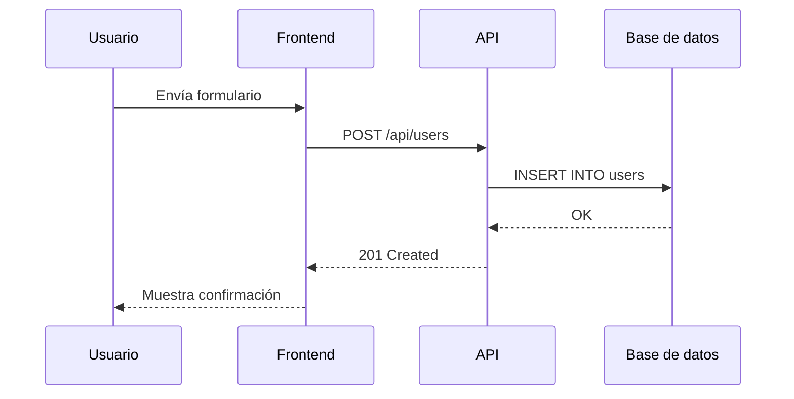
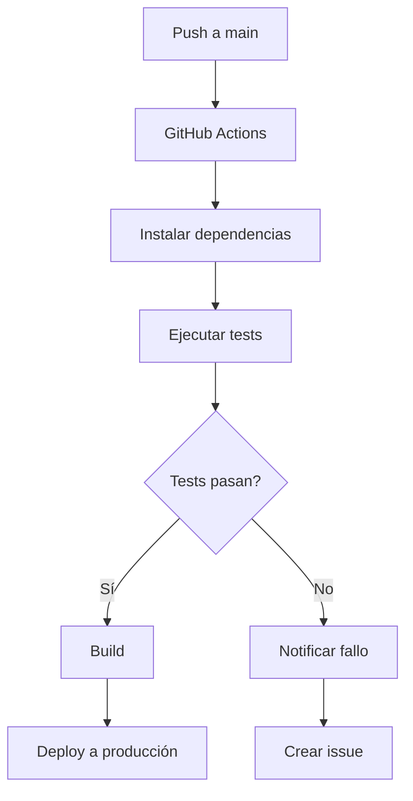
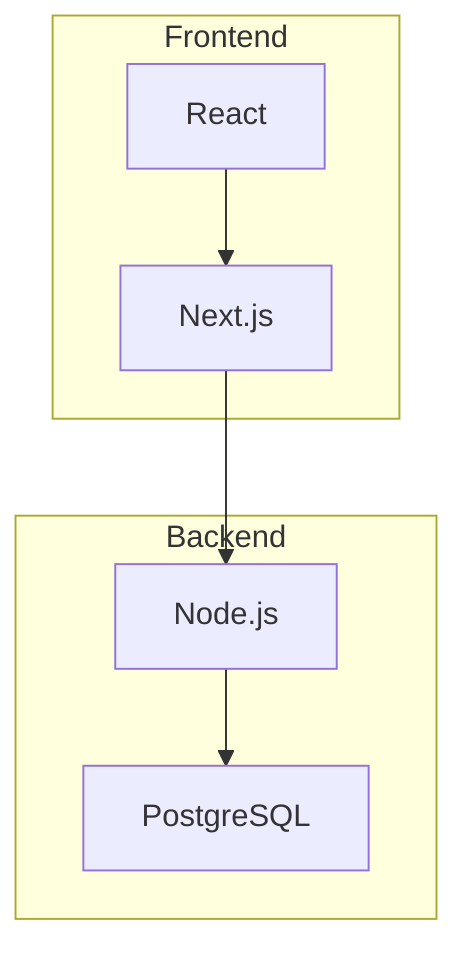

# Para Marjorie · 16 de septiembre

Página-regalo de cumpleaños (23 años).

## Desarrollo

```bash
npm install
npm run dev
```

## Música

Coloca los archivos en `public/music/` con estos nombres:

- `loco.mp3`
- `really.mp3`
- `falling-in-love.mp3`
- `guns-for-hands.mp3`
- `fade-into-you.mp3`
- `casio.mp3`
- `made-in-japan.mp3`
- `ella-viene-del-futuro.mp3`

## Build
```bash
npm run build
npm run preview
```















